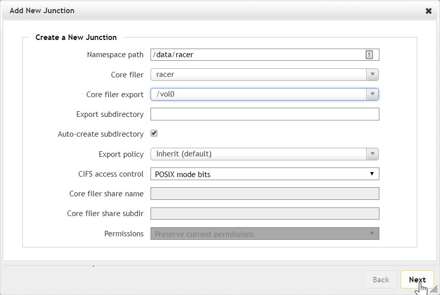

# Configure Storage

In this step you will set up the backend storage system for your vFXT cluster. 

There are two main tasks: 
1. [Create a core filer](#create-a-core-filer), which connects your vFXT cluster to an existing storage system or an Azure Storage Account.
1. [Create a namespace junction](#create-a-junction), which defines the path for clients to mount.

## Create a core filer
"Core filer" is a vFXT term for a backend storage system. The storage can be a hardware NAS appliance like NetApp or Isilon, or it can be a cloud object store. More information about core filers can be found [here](http://library.averesystems.com/ops_guide/4_7/settings_overview.html#managing-core-filers).

To add a core filer, choose one of the the two main types of core filers:
  1. [NAS core filer](#nas-core-filer) - describes how to add a NAS core filer 
  2. [Azure Storage Account cloud core filer](#azure-storage-account-cloud-core-filer) - describes how to add an Azure Storage account as a cloud core filer

### NAS core filer

A NAS core filer can be an on-premises NetApp or Isilon, or a NAS endpoint in the cloud.  

The following steps add a NAS core filer:

1. From the Avere Control Panel, click the **Settings** tab at the top.

2. Click **Manage Core Filers** on the left. 

3. Click **Create**.

   

   * Name your core filer.
   * Provide a fully qualified domain name (FQDN) if available. Otherwise, provide an IP address or hostname that resolves to your core filer.
   * Choose your filer class from the list. If unsure, choose **Other**.
   * Click **Next** and choose a cache policy. 
   * Click **Add Filer**.
   * For more detailed information refer to [Adding a new NAS core filer](http://library.averesystems.com/ops_guide/4_7/new_core_filer_nas.html).

Next, proceed to [Create a Junction](#create-a-junction).  

### Azure Storage cloud core filer

To use Azure Blob storage as your vFXT cluster's backend storage, you need an empty container to add as a cluster core filer.

**TIP:** To avoid the following steps, use the ``create-cloudbacked-cluster`` sample script if you want to create a storage container, core filer, and namespace junction at the same time as creating the vFXT cluster. The ``create-minimal-cluster`` sample script does not create an Azure storage container.

The following steps create an Azure storage account with an empty container and add it as a cloud core filer:

1. Create a general-purpose V2 storage account by clicking the "Deploy to Azure" button below.  You can add it to the same resource group as the vFXT.

   

2. After the account is created, click on the alert icon in the top right of the portal, and click **Go to resource group**.

   

3. Click the Azure storage account from the resource list.

   

4. Create a blob container by clicking **Blobs** on the overview page and then click **+Container**. Use any container name, and make sure access is set to **Private**.

   

5. Get the Azure Storage account key by clicking **Access keys** under **Settings**:

   

6. Browse to the Avere Control Panel for your cluster and click **Settings**, then **Cloud Credentials**, then **Add Credential**.

   

7. Fill in the following information to create a credential for the cloud core filer: 

   | Field | Value | 
   |---|---|
   | Credential name | any descriptive name |
   | Service type | (select Azure Storage Access Key) | 
   | Tenant | storage account name |
   | Subscription | subscription ID |
   | Storage Access Key | Azure storage account key (copied in the previous step) | 

   Click **Submit**.

   

8. To create the core filer, click **Manage Core Filers** in left pane of the Avere Control Panel settings tab.  

9. Click **Create**. 

10. Fill out the wizard:

   * Select **Cloud** filer type
   * Name the new core filer and click **Next**.
   
   * Accept the default cache policy and continue to the third page. 
   
   * In **Service type**, choose **Azure storage**. 
   * Choose the credential created earlier.
   * Set **Bucket contents** to **Empty**
   * Change **Certificate verification** to **Disabled**
   * Change **Compression mode** to **None**  
   * Click **Next**.
   
   * On the fourth page, enter the name of the container in **Bucket name** as *storage_account_name*/*container_name*.
   * Set **Encryption type** to **None**.  Azure Storage is encrypted by default.
   * Click **Add Filer**.
   * Refer to [Adding a new cloud core filer](<http://library.averesystems.com/ops_guide/4_7/new_core_filer_cloud.html>) for more detailed information. 

The page will refresh, or you can refresh the page to display your new core filer.

Next, proceed to [Create a Junction](#create-a-junction).

## Create a junction
A junction is a path that you create for clients. Clients mount the path and arrive at the destination you choose. 

For example, you could create `/avere/files` to map to your NetApp core filer `/vol0/data` export and the `/project/resources` subdirectory.

More information about junctions can be found [here](http://library.averesystems.com/ops_guide/4_7/gui_namespace.html).

- Click **Namespace** in the upper left.
- Provide a namespace path beginning with / (forward slash), like ``/avere/data``.
- Choose your core filer.
- Choose the core filer export.
- Click **Next**.

  

The junction will appear after a few seconds. Create additional junctions as needed.

## Next step: Mount clients
After creating the junction, proceed to [Mount the Avere vFXT cluster](mount_clients.md) to access the file system.
