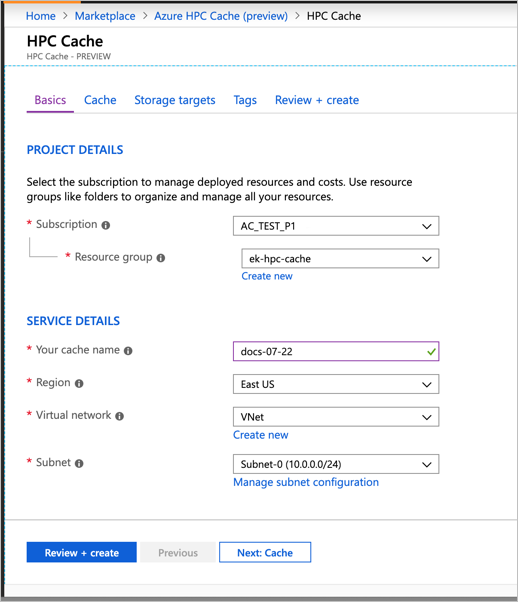
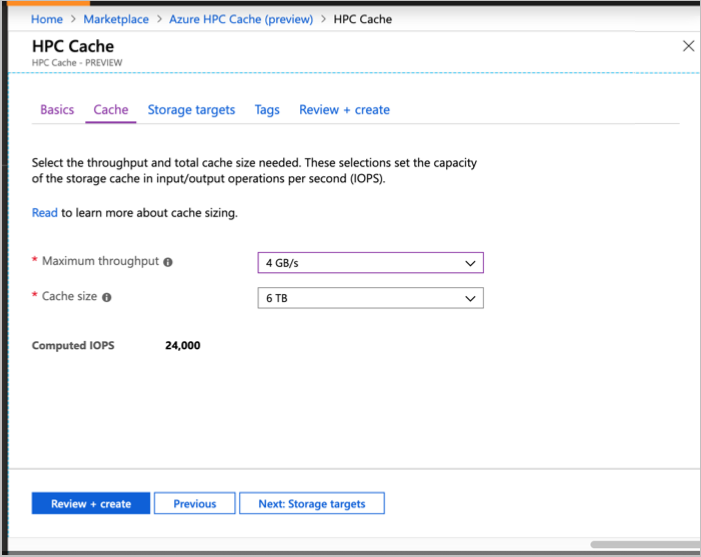
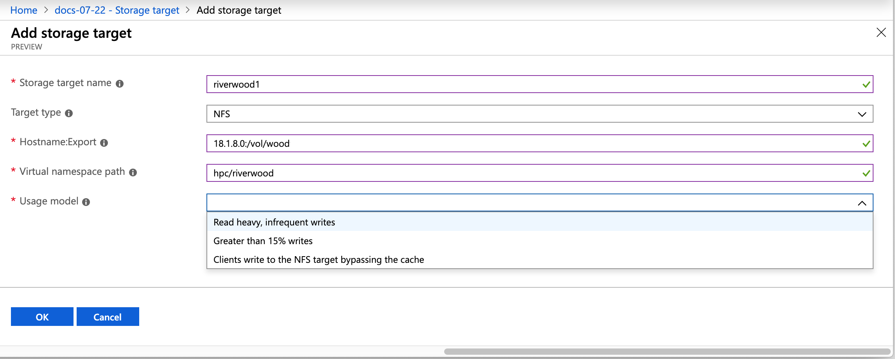
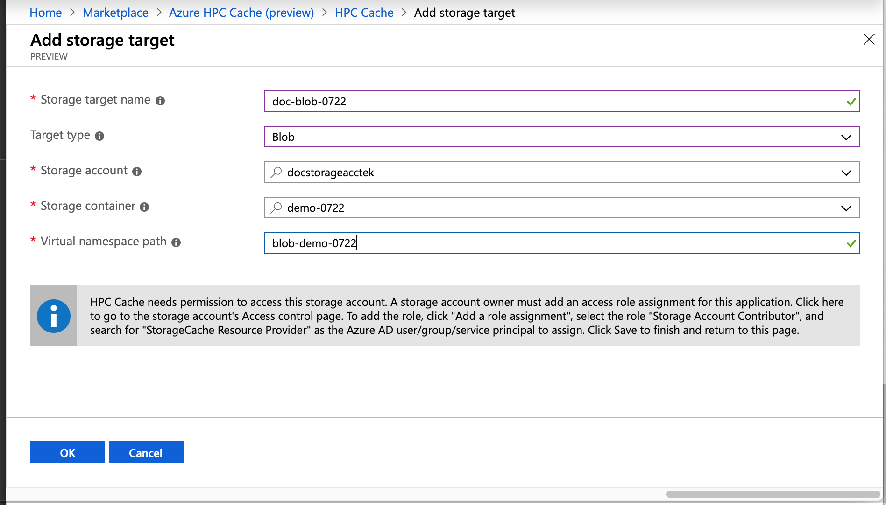
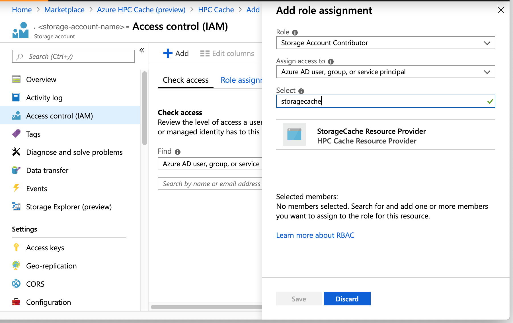
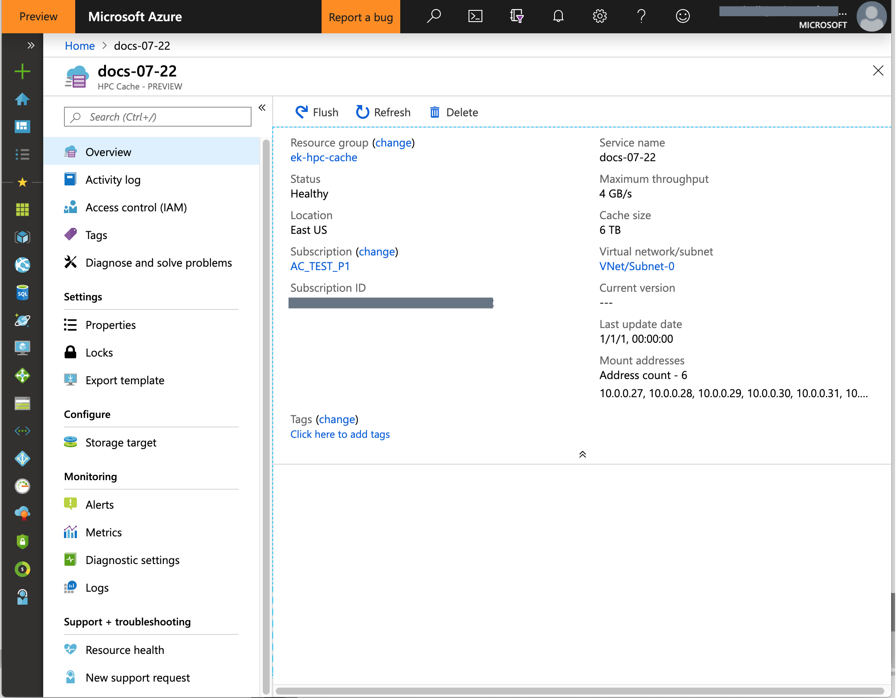

# HPC Cache Private Preview documentation

*Last updated 2019-07-25*  

This page provides documentation for the Azure HPC Cache private preview. It is being updated during the preview period and might change frequently. 

Because information is subject to change, please verify this information with your Microsoft Service and Support representative before using it in a high-value test or a production-impacting environment.

To join the private preview, contact **[???]**

## Getting started

Before using the Azure Portal to create a new Azure HPC Cache, check these prerequisites. 

* Your subscription must be whitelisted for the private preview program. Contact the Azure HPC Cache team to request access.

* The Azure HPC Cache needs a dedicated subnet for the cache. The best practice is to create a new subnet within your virtual network.

  * The subnet must have at least 64 IP addresses available.
  * The subnet cannot host any other VMs, even for related services like client machines.
  * If you use multiple cache instances, each one needs its own subnet.

* You must authorize storage account access by giving the Azure HPC Cache instance Storage Account Contributor role privileges on your account. If you are not the storage account owner, have the owner do this step. Details are [below](#add-the-access-control-role-to-your-account). 

* Storage prerequisites - if you want to use Azure Blob storage with the Azure HPC Cache, you need a compatible storage account and an empty Blob container. 

  If you want to add the storage when you create the cache, you need to create the container ahead of time. However, you can add storage afterward. 

  To create a compatible storage account, use these settings: 

  * Performance: **Standard** 
  * Account kind: **StorageV2 (general purpose v2)**
  * Replication: **Locally redundant storage (LRS)**
  * Access tier (default): **Hot** 
  * It is a good practice to use a storage account in the same location as your cache. 

**Note:** Additional requirements apply to the private preview offering. Read [Private preview prerequisites](hpc-cache-preview/preview-prereqs.md) for a current list. 

## Creating a cache

Use the Azure portal to create the cache instance. During the private preview, your subscription must be whitelisted, and the Azure HPC Cache team will share the URL to use to create a cache instance. 

 

### Basics



In **Project Details**, select the subscription and resource group that will host the Azure HPC Cache. Make sure the subscription is the one that was whitelisted by the preview team. 

In **Service Details**, set the cache name. Choose the region and the virtual network for the cache. Choose or create a subnet with at least 64 IP addresses (/24) that will be used only for the Azure HPC Cache. 

### Cache sizing 

Use the **Cache** page to set up the throughput for your Azure HPC Cache. 

Cache capacity is determined by two factors: 

  * The number of operations per second that you want the cache to support
  * The amount of data you want to have room for in the cache storage

Choose one of the available throughput values (in GB/second) and cache storage sizes (in TB). The IOPS capacity is calculated and shown underneath the value selectors. 



### Adding storage targets

Storage targets are the long-term storage for the contents of your cache. You can add a storage targets as part of cache creation, but you can also add them afterward in the Configure section of the cache page. 


Click the **Add storage target link** to define your back-end storage systems. The storage can be Blob containers or on-premises NFS systems. 

You can define up to ten different storage targets. 

Slightly different information is used for Blob storage targets than for NFS storage targets. 

Common information for both types of storage targets: 

* **Storage target name** - Set the name that the Azure HPC Cache will display for this storage target.
* **Target type** - Select either Blob or NFS depending on the type of access for the long-term storage.
* **Virtual namespace path** - Set the client-facing filepath for this storage target. Read [Using the aggregated namespace, below](#using-the-aggregated-namespace), for details.

For an NFS storage target, you must specify how to reach the storage export and how to efficiently cache its data: 

* **Hostname:Export** - Provide the fully qualified domain name (FQDN) and export that the storage target will point to. You can create multiple storage targets to represent different exports on the same NFS storage system. 

  **Note:** Although the example in the screenshot uses an IP address, FQDN is preferred. An IP address can be used if necessary.

* **Usage model** - Choose one of the data caching profiles based on your workflow, described [below](#choose-a-usage-model).

#### Choose a usage model

When you create a storage target that points to an NFS storage system, you need to choose the *usage model* for that target. This model determines how your data is cached.

  * Read heavy - If you mostly use the cache to speed up data read access, choose this option. 
  * Read/write - If clients use the cache to read and write, choose this option.
  * Clients bypass the cache - Choose this option if your clients write data directly to the storage system without first writing to the cache. 



For a Blob storage target, you also need to supply this information: 

* **Storage account** - The account that hosts the container
* **Storage container** - The name of the empty container to reference

You can move data to the Blob storage target after the cache is created. Consult your Azure HPC Cache support representative for more information.



If you have not already done it, add the access role permission to the storage account as explained [below](#add-the-access-control-role-to-your-account). 


#### Add the access control role to your account

During the private preview, the HPC Cache uses [role-based access control (RBAC)](https://docs.microsoft.com/azure/role-based-access-control/index) to authorize the HPC Cache application to access your storage account for Azure Blob storage targets. 

The storage account owner must explicitly add the role [Storage Account Contributor](https://docs.microsoft.com/azure/role-based-access-control/built-in-roles#storage-account-contributor) for the user "StorageCache Resource Provider". 

You can do this when you add the Blob storage target as part of creating the HPC Cache instance. Links are provided in the storage target section of the creation wizard.

Steps to add the RBAC role: 

1. Open the **Access control (IAM)** page for the storage account.
1. Click the **+** at the top of the page and choose **Add a role assignment**.
1. Select the role "Storage Account Contributor" from the list.
1. In the **Assign access to** field, leave the default value selected ("Azure AD user, group, or service principal").  
1. In the **Select** field, search for "storagecache". This should match one security principal, named HPC Cache Resource Provider. Click that principal to select it. 
1. Click the **Save** button to add the role assignment to the storage account. 



#### Using the aggregated namespace 

The HPC Cache allows clients to access a variety of storage systems through a virtual namespace that hides the details of the back-end storage system. 

When you add a storage target, you set the client-facing filepath. Client machines mount this filepath. You can change the storage target associated with that path, for example to replace a hardware storage system with cloud storage, without needing to rewrite client-facing procedures. 

## Finished cache 

After about 10 minutes, the Azure HPC Cache is visible in your subscription's Resources list. 



## Access the Azure HPC Cache system

After the cache is created, NFS clients can access it with a simple mount command. 

Use the mount addresses listed on the cache overview page and the virtual namespace path that you set when you created the storage target. 


**Note:** The cache mount addresses correspond to network interfaces inside the cache's subnet. These NICs appear in the resource group with names ending in `-cluster-nic-` and a number. Do not alter or delete these interfaces, or the cache will become unavailable. 

The storage targets paths are shown in the Storage Targets page. 


Use a mount command like the following: 

sudo mount *cache_mount_address*:/*storage_target_path* *local_path*

Example: 

```
root@test-client:/tmp# mkdir hpccache
root@test-client:/tmp# sudo mount 10.0.0.28:/blob-demo-0722 ./hpccache/
root@test-client:/tmp# 
```

After this command succeeds, the contents of the storage export should be visible in the ``hpccache`` directory on the client. 

**Note:** Your clients must be able to access the secure virtual network and subnet that houses your cache. For example, create client VMs within the same virtual network, or use a jump host in the virtual network for access from outside. (Remember that nothing else can be hosted inside the cache's subnet.)

## Additional information

More details about the Azure HPC Cache will be available in September 2019. 

### Terms of service

This product is in Private Preview. Terms of Service will be available in Public Preview or General Availability phases.

### Pricing

This product is in Private Preview. Pricing information will be available during the Public Preview or General Availability phase.


