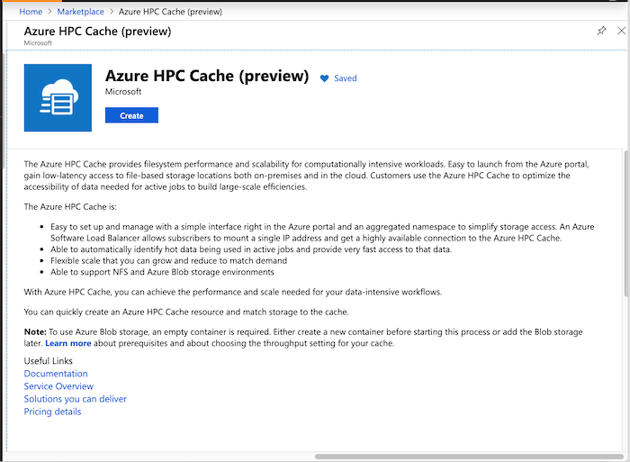
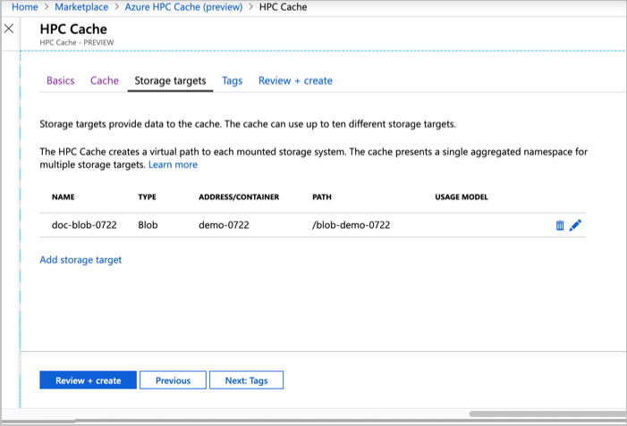
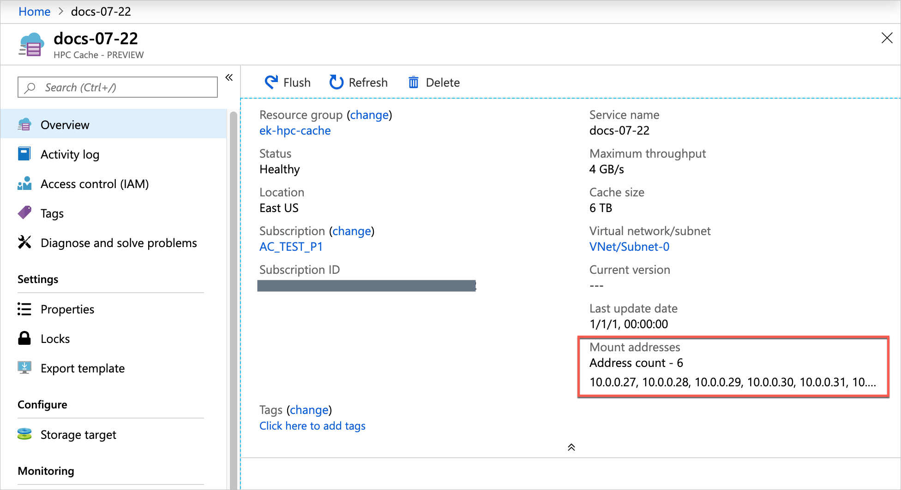

# Azure HPC Cache Private Preview documentation

*Last updated 2019-07-31*  

This page provides documentation for the Azure HPC Cache private preview. It is being updated during the preview period and might change frequently. 

Because information is subject to change, please verify this information with your Azure HPC Cache team representative before using it in a high-value test or a production-impacting environment.

<!-- To join the private preview, contact **[???]** -->

## About Azure HPC Cache Private Preview

Azure HPC Cache is a high performance cache for file-based workloads. It solves the latency problem between compute and storage for read-heavy workloads. Customers can use show a single virtual filesystem that includes data located in an on-premises datacenter, in Azure, or from both locations. The Azure HPC Cache provides scale into tens of thousands of cores.  

The technology and capabilities are similar to [Avere vFXT for Azure](https://docs.microsoft.com/azure/avere-vfxt/), but Azure HPC Cache is provided as a more integrated service in Azure, with a streamlined setup.

The goal of the private preview is to get feedback and testing from a select set of users. This input will help improve the product for the upcoming public preview and for the eventual GA release. 

## Prerequisites

Before using the Azure Portal to create a new Azure HPC Cache, make sure your environment is set up to meet these prerequisites. More information about some of these requirements is provided in [Additional prerequisites](hpc-cache-preview/preview-prereqs.md).

### Azure subscription

* Your subscription must be whitelisted for the private preview program. Contact the Azure HPC Cache team to request access.

* A paid subscription is recommended. Read [Additional prerequisites](hpc-cache-preview/preview-prereqs.md) for more information.

### Network infrastructure

* The Azure HPC Cache needs a dedicated subnet for the cache. The best practice is to create a new subnet within your virtual network.

  * The subnet must have at least 64 IP addresses available.
  * The subnet cannot host any other VMs, even for related services like client machines.
  * If you use multiple cache instances, each one needs its own subnet.

* The cache's virtual network needs access to the Azure DNS server. If you set up a custom DNS server, you must configure forwarding so that the cache can access Azure service endpoints.

  A custom DNS server is needed to resolve hostnames for on-premises storage and can be useful if you want round-robin load balancing among the cache's mount addresses.

  For more information about setting up a DNS system and configuring forwarding for Azure resources, read [Name resolution for resources in Azure virtual networks](https://docs.microsoft.com/en-us/azure/virtual-network/virtual-networks-name-resolution-for-vms-and-role-instances).

### Permissions

* The Azure HPC Cache needs to be able to create virtual network interfaces (NICs). The user who creates the cache must have sufficient privileges in the subscription to create NICs. There are several ways to authorize this access; read [Additional prerequisites](hpc-cache-preview/preview-prereqs.md) to learn more.

* If using Blob storage, the Azure HPC Cache application needs authorization to access your storage account as a Storage Account Contributor. Details are [below](#add-the-access-control-role-to-your-account).

### Storage infrastructure

* If you want to use Azure Blob storage with the Azure HPC Cache, you need a compatible storage account and an empty Blob container.

  You can add storage targets at the time you create the cache, or afterward.

  To create a compatible storage account, use these settings:

  * Performance: **Standard**
  * Account kind: **StorageV2 (general purpose v2)**
  * Replication: **Locally redundant storage (LRS)**
  * Access tier (default): **Hot**

  It is a good practice to use a storage account in the same region as your cache.

* Authorize the cache to access your Azure storage account by assigning it the Storage Account Contributor role as described [below](#add-the-access-control-role-to-your-account). If you are not the storage account owner, have the owner do this step.

* On-premises NFS storage must be a compatible hardware/software platform. Contact the Azure HPC Cache team for details.

## Create a cache

Use the Azure portal to create the cache instance. During the private preview, your subscription must be whitelisted, and you must use the URL [aka.ms/azhpccache](<https://aka.ms/azhpccache>) to access the hidden Azure HPC Cache preview offering.

 

### Basics


In **Project Details**, select the subscription and resource group that will host the Azure HPC Cache. Make sure the subscription is the one that was whitelisted by the preview team. 

In **Service Details**, set the cache name and these other attributes: 

* Location - Only **East US** is supported during the private preview. 
* Virtual network - You can select an existing one or create a new virtual network. 
* Subnet - Choose or create a subnet with at least 64 IP addresses (/26) that will be used only for the Azure HPC Cache.

### Cache sizing
<!-- change to "set cache size" if we can change the link in the GUI -->

On the **Cache** page, you must set the capacity of your Azure HPC Cache.

Cache capacity is determined by two factors: 

* The number of operations per second that you want the cache to support (throughput)
* The amount of data you want to have room for in the cache storage

Choose one of the available throughput values (in GB/second) and cache storage sizes (in TB). The IOPS capacity is calculated and shown underneath the value selectors. 


### Add storage targets

Storage targets are the long-term storage for the contents of your cache. You can define storage targets while creating the cache, but you can also add them afterward with the link in the **Configure** section of your cache's page in the portal. 



Click the **Add storage target link** to define your back-end storage systems. The storage can be Blob containers or on-premises NFS systems.

You can define up to ten different storage targets.

Slightly different information is used for Blob storage targets than for NFS storage targets.

Common information for both types of storage targets:

* **Storage target name** - Set the name that the Azure HPC Cache will display for this storage target.
* **Target type** - Select either Blob or NFS depending on the type of access for the long-term storage.
* **Virtual namespace path** - Set the client-facing filepath for this storage target. Read [Using the aggregated namespace, below](#using-the-aggregated-namespace), for details.

For an NFS storage target, you must specify how to reach the storage export and how to efficiently cache its data:

* **Hostname:Export** - Provide the fully qualified domain name (FQDN) and export that the storage target will point to. You can create multiple storage targets to represent different exports on the same NFS storage system.

  **Note:** Although the example in a screenshot below uses an IP address, FQDN is preferred. An IP address can be used if necessary.

* **Usage model** - Choose one of the data caching profiles based on your workflow, described in [Choose a usage model, below](#choose-a-usage-model).

For a Blob storage target, you also need to supply this information: 

* **Storage account** - The account that hosts the container
* **Storage container** - The name of the empty container to reference

  You can move data to the Blob storage target after the cache is created. Consult your Azure HPC Cache support representative for more information.
* If you have not already done it, add the access role permission to the storage account as explained [below](#add-the-access-control-role-to-your-account).


[#add-the-access-control-role-to-your-account](#### Add the access control role to your account (Blob storage only))


The Azure HPC Cache uses [role-based access control (RBAC)](https://docs.microsoft.com/azure/role-based-access-control/index) to authorize the cache application to access your storage account for Azure Blob storage targets. 

The storage account owner must explicitly add the role [Storage Account Contributor](https://docs.microsoft.com/azure/role-based-access-control/built-in-roles#storage-account-contributor) for the user "StorageCache Resource Provider". 

You can do this when you add the Blob storage target as part of creating the cache instance. Links are provided in the storage target section of the creation wizard.

Steps to add the RBAC role: 

1. Open the **Access control (IAM)** page for the storage account.
1. Click the **+** at the top of the page and choose **Add a role assignment**.
1. Select the role "Storage Account Contributor" from the list.
1. In the **Assign access to** field, leave the default value selected ("Azure AD user, group, or service principal").  
1. In the **Select** field, search for "storagecache". This should match one security principal, named HPC Cache Resource Provider. Click that principal to select it. 
1. Click the **Save** button to add the role assignment to the storage account. 


#### Choose a usage model
<!-- link in GUI to this heading -->

*(NFS storage targets only)*

When you create a storage target that points to an NFS storage system, you need to choose the *usage model* for that target. This model determines how your data is cached.

  * Read heavy - If you mostly use the cache to speed up data read access, choose this option. 
  * Read/write - If clients use the cache to read and write, choose this option.
  * Clients bypass the cache - Choose this option if your clients write data directly to the storage system without first writing to the cache. 


#### Using the aggregated namespace
<!-- link in GUI to this heading -->

The Azure HPC Cache allows clients to access a variety of storage systems through a virtual namespace that hides the details of the back-end storage system.

When you add a storage target, you set the client-facing filepath. Client machines mount this filepath. You can change the storage target associated with that path, for example to replace a hardware storage system with cloud storage, without needing to rewrite client-facing procedures.

## Finished cache

After about 10 minutes, the Azure HPC Cache is visible in your subscription's **Resources** list. 


## Access the Azure HPC Cache system

After the cache is created, NFS clients can access it with a simple mount command. 

Use the mount addresses listed on the cache overview page and the virtual namespace path that you set when you created the storage target. 



**Note:** The cache mount addresses correspond to network interfaces inside the cache's subnet. These NICs appear in the resource group with names ending in `-cluster-nic-` and a number. Do not alter or delete these interfaces, or the cache will become unavailable. 

The storage targets paths are shown in the Storage Targets page. 


Use a mount command like the following: 

sudo mount *cache_mount_address*:/*storage_target_path* *local_path*

Example: 

```
root@test-client:/tmp# mkdir hpccache
root@test-client:/tmp# sudo mount 10.0.0.28:/blob-demo-0722 ./hpccache/
root@test-client:/tmp# 
```

After this command succeeds, the contents of the storage export should be visible in the ``hpccache`` directory on the client. 

**Note:** Your clients must be able to access the secure virtual network and subnet that houses your cache. For example, create client VMs within the same virtual network, or use a jump host in the virtual network for access from outside. (Remember that nothing else can be hosted inside the cache's subnet.)

## Populate new Blob storage

If you are using a new Blob container as a storage target, you might want to move your existing data to the container as soon as you connect a few clients. The Azure HPC Cache optimizes back-end writes in parallel, so the most efficient way to move data onto its back-end storage is through multiple connections. 

The [Parallel data ingest](https://docs.microsoft.com/en-us/azure/avere-vfxt/avere-vfxt-data-ingest) documentation provided for the Avere vFXT for Azure product outlines data copying strategies that work well with the Azure HPC Cache.

Note that a basic, single-threaded copy operation does not give a good result when moving large datasets to Blob storage through the Azure HPC Cache.

## Additional information

More details about the Azure HPC Cache will be available in September 2019. 

### Terms of service
<!-- link in GUI to this heading -->

This product is in Private Preview. Terms of Service will be available in Public Preview or General Availability phases.

### Pricing
<!-- link in GUI to this heading -->

This product is in Private Preview. Pricing information will be available during the Public Preview or General Availability phase.
