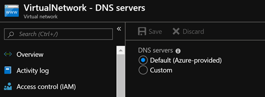

# Additional prerequisites for Azure HPC Cache private preview

These additional prerequisites apply to the private preview release. 

**Region** 

Private preview is enabled only for the East US location. 

**Azure subscription** 

You must have an Azure subscription. There are no specific limits to the type of subscription, but testing has not been completed for partner or free tier subscriptions. Please use a paid subscription for the Azure HPC Cache private preview. 

**Access permission and roles** 

The bulk of the service lies outside of your subscription, so high-level permissions aren't necessary.  However, the Azure HPC Cache needs to be able to create virtual NICs in the subscription. 

The user creating the cache must either: 

* Be a Service Administrator for the subscription, or 
* Be assigned the Contributor role for the subscription. 

[Read more about subscription administrative access in Azure](https://docs.microsoft.com/azure/role-based-access-control/rbac-and-directory-admin-roles)

If you want to use a more specific role, or have questions about applying permissions to a smaller scope (like a resource group), please contact the private preview team (0c454b08.microsoft.com@amer.teams.ms) with your environment's requirements.

**Resource Group**

You need a standard resource group for the cache.

You can put the Azure HPC Cache in a resource group that includes other resources, but if you have security requirements that require scoping (see Access permissions and roles, above) you might want to use a resource group dedicated to the cache environment.

**Virtual network and subnet**

The Azure HPC Cache network interfaces will reside in a specific virtual network and subnet in your subscription. 

You should create a dedicated subnet for the Azure HPC Cache to ensure that there are no conflicts with IP address acquisition from other assets in your subscription. The cache needs exclusive access to its range of IP addresses.  

* The subnet should hold 64 IP addresses. 

* Do not install clients in the same subnet. 

  Hosting clients in the same subnet increases the chance of an IP address conflict with the cache. If the cache has a failover, it might lose an IP address at the same time a client asset in the subnet attempts to bind one. If the client asset receives the IP address that the cache expects, there is a conflict that can delay cache operation. That conflict is avoided if you isolate the cache service in its own subnet. 

* **DNS** - The virtual network must use the default DNS server configuration.

  The Azure HPC Cache requires the default Azure DNS server configuration for name resolution. Make sure the virtual network is configured as shown below: 
  
  

* **NTP** - Azure HPC Cache uses time.windows.com as its NTP server and will set that automatically.

**Client access**

Clients can mount the cluster and make NFS requests to access the cache. SMB access is not supported.
