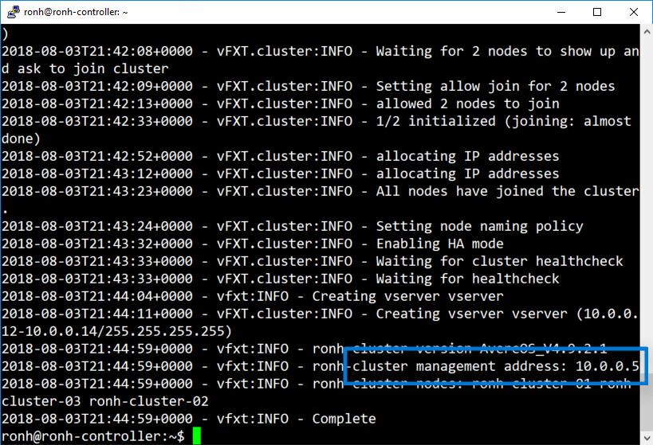

# Deploy a vFXT cluster
The easiest way to create a vFXT cluster is to use a cluster controller node, a VM that has the required scripts, templates, and software infrastructure for creating the vFXT cluster. 

In this tutorial, you will create a controller node and use it to create a vFXT cluster.  By the end of this tutorial, you will have a virtual network (VNet), a controller, and a vFXT cluster as shown in the following diagram:


This tutorial assumes that you have checked and configured the following prerequisites:

1. [New subscription](prereqs.md#create-a-new-subscription)
1. [Subscription owner permissions](prereqs.md#subscription-owner-permissions)
1. [Quota for the vFXT cluster](prereqs.md#quota-for-the-vfxt-cluster)
1. [Term acceptance for the marketplace images](prereqs.md#accepting-terms-for-the-two-marketplace-images)
1. [Azure RBAC role](prereqs.md#create-an-azure-rbac-role)

## Create controller

To create the cluster controller node from the portal, click the "Deploy to Azure" button below. This deploy template creates the VM that will create and manage the Avere vFXT cluster. 

<a href="https://portal.azure.com/#create/Microsoft.Template/uri/https%3A%2F%2Fraw.githubusercontent.com%2FAzure%2FAvere%2Fmain%2Fsrc%2Fvfxt%2Fazuredeploy.json" target="_blank">

</a>

Add a name for the new resource group, update the controller name and password, and click **Purchase**.  After five or six minutes, your controller node will be up and running.

## Add storage endpoint

Storage endpoints keep Azure blob traffic local rather than traveling out to the internet. While the controller is being created, add a storage endpoint to your vnet.

1. From the portal, click “Virtual Networks” on the left.
1. Select the vnet for your controller. 
1. Click “Service Endpoints” on the left.
1. Click “Add” at the top.
1. Leave the service at Microsoft.Storage and choose the controller’s subnet.
1. At the bottom, click "Add."

   

## Browse to outputs

The outputs from creating the cluster controller node include information that you need to create your Avere vFXT cluster.

1. From the notification icon on the top bar of the Azure portal, click **Go to resource group**. This will show the new resource group that contains your controller and VNet.

   

2. On left side, click **Deployments**, and then **Microsoft.Template**.

   

3. On left side, click **Outputs**. Copy the values in each of the fields. 

   

## Create cluster
Now that your controller node is running, you need to access the controller node, edit a built-in sample script, and run the script to create the cluster. 

### Access the controller

1. SSH to the controller, using the **SSHSTRING** value from the Outputs screen [(above)](#browse-to-outputs).

2. Authenticate by running `az login`. Copy the authentication code supplied in the shell, then use a web browser to load <a href="https://microsoft.com/devicelogin" target="_blank">https://microsoft.com/devicelogin</a> and authenticate with the Microsoft system. Return to the shell for confirmation.

   

3. Specify your subscription by running this command with your subscription ID:  ```az account set --subscription YOUR_SUBSCRIPTION_ID```

### Edit the deployment template

Copy and edit the `create-minimal-cluster` sample script. 

Example:
```sh
cp /create-minimal-cluster ./cmc
vi cmc
```

Edit the following fields in the `cmc` script to supply the values you captured from [outputs (above)](browse-to-outputs) for resource group, location, virtual network, and subnet:

```bash
RESOURCE_GROUP=<from controller Outputs>
LOCATION=<from controller Outputs>
NETWORK=<from controller Outputs>
SUBNET=<from controller Outputs>
```

Specify the name of the cluster role you created in the [prerequisites](prereqs.md#create-an-azure-rbac-role), and add an administrative password for the cluster:

```bash
AVERE_CLUSTER_ROLE=<name of role created above (avere-cluster)>
ADMIN_PASSWORD=<your_unique_vfxt_cluster_password>
```

Save the file and exit.

### Run the script
Run the script by typing `./cmc`.  It is recommended to run this command inside a [terminal multiplexer](http://linuxcommand.org/lc3_adv_termmux.php) such as `screen` or `tmux` in case you lose your connection.  The output is alternatively logged to ~/vfxt.log.

When the script completes, copy the management IP address.



### Next step: accessing the new cluster
Now that the cluster is running and you know its management IP address, you can now [access the cluster](access_cluster.md) to add storage.
