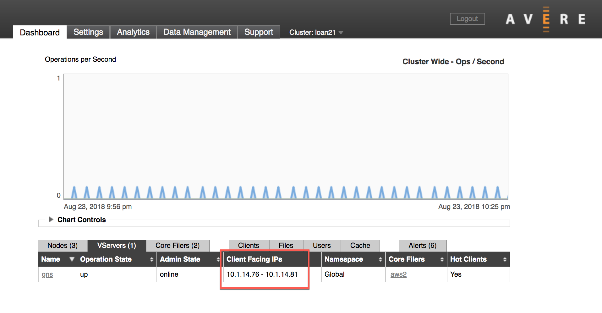

# Mounting the Avere vFXT cluster

Follow these steps to connect client machines to access your vFXT cluster.

1. Configure a core filer and junction as described in the previous step, [Configure storage](configure_storage.md).
1. Decide how to load-balance client traffic among your cluster nodes. Read [Balancing client load](balancing-client-load), below, for details. 
1. Choose the [IP address and junction path](#identifying-ip-addresses-and-paths-to-mount) to mount.
1. Issue the [mount command](#mount-command-arguments), with appropriate arguments.


## Balancing client load

To help balance client requests among all the nodes in the cluster, you should mount clients to the full range of client-facing IP addresses. There are several simple ways to automate this task. 

(Other load balancing methods might be appropriate for large or complicated systems; [open a support ticket](engage_support.md#raise-a-support-ticket-for-your-avere-vfxt) for help.)

> Tip: If you prefer to use a DNS server for automatic server-side load balancing, you must set up and manage your own DNS server within Azure. In that case, you can configure round-robin DNS for the vFXT cluster according to this document: [Avere cluster DNS configuration](configure_dns.md).

### Sample balanced client mounting script

This code example uses client IP addresses to distribute clients to all of the vFXT cluster's available IP addresses. 

```bash
function select_vserver_address() {
    # to ensure node traffic is spread out somewhat evenly the default 
    # mount point is based on this node's IP octet4 % vFXT node count.
    declare -a AVEREVFXT_NODES="($(echo ${NFS_IP_CSV} | sed "s/,/ /g"))"
    OCTET4=$((`hostname -i | sed -e 's/^.*\.\([0-9]*\)/\1/'`))
    DEFAULT_MOUNT_INDEX=$((${OCTET4} % ${#AVEREVFXT_NODES[@]}))
    SELECTED_IP=${AVEREVFXT_NODES[${DEFAULT_MOUNT_INDEX}]}

    DEFAULT_MOUNT_POINT="${BASE_DIR}/default"

    # no need to write again if it is already there
    if ! grep --quiet "${DEFAULT_MOUNT_POINT}" /etc/fstab; then
        echo "${SELECTED_IP}:${NFS_PATH}    ${DEFAULT_MOUNT_POINT}    nfs hard,nointr,proto=tcp,mountproto=tcp,retry=30 0 0" >> /etc/fstab
        mkdir -p "${DEFAULT_MOUNT_POINT}"
        chown nfsnobody:nfsnobody "${DEFAULT_MOUNT_POINT}"
    fi
    if ! grep -qs "${DEFAULT_MOUNT_POINT} " /proc/mounts; then
        retrycmd_if_failure 12 20 mount "${DEFAULT_MOUNT_POINT}" || exit 1
    fi   
} 
```
The function above is part of the [Batch example](maya_azure_batch_avere_vfxt_demo.md); the entire file is available [here](../src/tutorials/mayabatch/centosbootstrap.sh).

## Identifying IP addresses and paths to mount

Newly installed linux machines need the nfs client tools installed if not already installed.  Here is the sample command for ubuntu to install the nfs client tools:

```bash
apt-get update
apt-get install nfs-common
```

From your client, the ``mount`` command maps the cluster vserver to a path on the local filesystem.  

The vserver path is identified with its IP address, plus the path to the junction that you defined.

Example: ``mount 10.0.0.12:/avere/files /mnt/vfxt``

The IP address is one of the client-facing IP addresses defined for the vserver. You can find the range of client-facing IPs in the Avere Control Panel in two places:

* The VServers table in the Dashboard - 
 
  

* The Client Facing Network settings page - 

  

The junction path corresponds to the **Namespace path** field you defined when creating the junction. For example, if you used ``/avere/files`` as your namespace path, your clients would mount *IP_address*:/avere/files to their local mount point. 


In addition to the paths, include the [Mount command arguments](mount-command-arguments) described below when mounting each client.

## Mount command arguments

To ensure a seamless client mount, pass these settings and arguments in your mount command: 

``mount -o hard,nointr,proto=tcp,mountproto=tcp,retry=30 ${VSERVER_IP_ADDRESS}:/${NAMESPACE_PATH} ${LOCAL_FILESYSTEM_MOUNT_POINT}``


| Required settings | |
--- | --- 
``hard`` | Soft mounts to the vFXT cluster are associated with application failures and possible data loss. 
``proto=netid`` | This option supports appropriate handling of NFS network errors.
``mountproto=netid`` | This option supports appropriate handling of network errors for mount operations.
``retry=n`` | Set ``retry=30`` to avoid transient mount failures. (A different value is recommended in foreground mounts.)

| Preferred settings  | |
--- | --- 
``nointr``            | The option "nointr" is preferred for clients with legacy kernels (prior to April 2008) that support this option. Note that the option "intr" is the default.


## Next steps 

Refer to the [How-to guides](https://github.com/Azure/Avere#how-to-guides) for additional cluster tasks, including: 
* [Moving data to the cluster core filer](getting_data_onto_vfxt.md)
* [Managing the cluster](start_stop_vfxt-py.md)
* [Cluster tuning](tuning.md)
