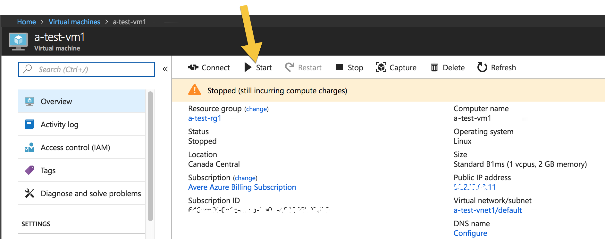

# Managing instances

This section explains how to stop, restart, and destroy cloud instances that serve as vFXT cluster nodes.

## Stopping instances

If you need to stop an instance (one node) or the entire cluster and intend to restart it later, Avere Systems recommends using the Avere Control Panel.

The **FXT Nodes** settings page has controls for shutting down or rebooting individual nodes.(Note that IP addresses might move among cluster nodes when the number of active nodes changes.) Read :ref:`settings:gui_fxt_nodes` for more information.

To stop or reboot the entire cluster, use the **System Maintenance** settings page. Read :ref:`settings:gui_system_maintenance` for details.

..note:: Do not use the stop option from the Azure portal, because vFXT nodes that are stopped using this method are not guaranteed to write all changed data to the core filer before shutdown.

If you need to stop an instance or the entire cluster but do not intend to restart it, you can delete the instance by using tools in the Azure portal. See :ref:`terminate_instance` for more information.

..**[ xxx I believe the following is true according to https://docs.microsoft.com/en-us/azure/virtual-machines/linux/classic/faq-classic?toc=%2Fazure%2Fvirtual-machines%2Flinux%2Fclassic%2Ftoc.json#how-does-azure-charge-for-my-vm but we should check xxx ]**

..note:: Although compute charges are not incurred while instances are stopped, storage charges continue, including for the storage volume used for the node's operating system and local cache storage.

..this /\ is the difference between a node that shows stopped on the portal and stopped (deallocated) - deallocated means you stopped it from the portal and its infrastructure disks were torn down.

## Restarting instances

If you need to restart a stopped instance, you must use the |az| portal.Select **Virtual machines** in the left menu and then click on the VM name in the list to open its overview page.

Click the **Start** button at the top of the overview page to reactivate the VM.

.._terminate_instance:

## Deleting instances

..Caution:: Deleted instances cannot be restarted or retrieved.Instance deletion is a permanent action and cannot be undone.

Before deleting a vFXT instance, remove it from the cluster or shut down the cluster as described below in :ref:`node_terminate` and :ref:`cluster_terminate`.

### Deleting a cluster node

If you want to delete one node from the vFXT cluster but keep the remainder of the cluster, you must first remove the node from the cluster using the Avere Control Panel.

..Caution:: If you delete a node without first removing it from the vFXT cluster, data might be lost.

To permanently destroy one or more instances used as vFXT node, use the Azure portal.
Select **Virtual machines** in the left menu and then click on the VM name in the list to open its overview page.

Click the **Delete** button at the top of the overview page to permanently destroy the VM.

.._cluster_terminate:

### Deleting all nodes in the vFXT cluster

If you are finished using the vFXT cluster and want to permanently delete it, you should shut down the cluster by using the Avere Control Panel first.A graceful shutdown allows any unsaved client changes to be written to permanent storage, ensuring data integrity.

Use the :ref:`settings:gui_system_maintenance` settings page to power down the cluster.After the cluster has stopped posting messages to the **Dashboard** tab, the Avere Control Panel session will stop responding and you will know that the cluster has been shut down.

After shutting down the cluster, use the Azure portal to destroy all of the node instances.You can delete them one at a time as described above in :ref:`node_terminate` or you can use the **Virtual Machines** page to find all of the cluster VMs, select them with the checkboxes, and click the **Delete** button to remove them all in one action.

