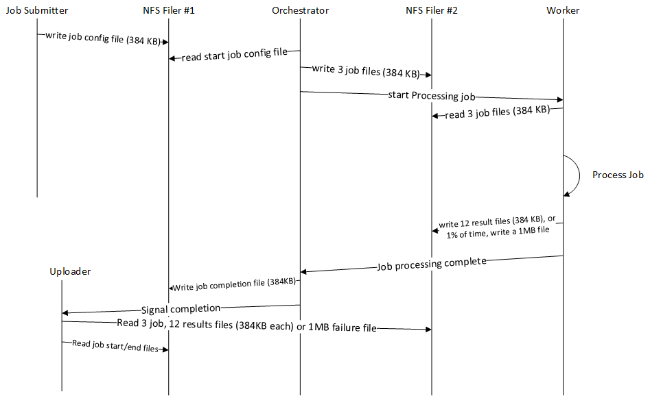

# EDA Simulator to test Filer Performance

This EDA Simulator helps test filer performance.  The simulator has 4 components:
 1. **jobsubmitter** - the task that submits job config files for processing
 1. **orchestrator** - the task the reads the job config files and writes workstart files, and submits work to workers for processing.  This also receives completed jobs from workers, writes a job complete file, and submits a job for upload.
 1. **worker** - the task that takes a workitem, reads the start files, and writes the complete files and or error file depending on error probability. 
 1. **uploader** - this task receives upload tasks for each completed job, and reads all job config files and job work files.
 
The job uses Azure Storage Queue for work management, and uses event hub for measuring file statistics.  The goal of the EDA simulator is to test with various filers to understand the filer performance characteristics.  There is a tool named `statscollector` that will collect and summarize the performance runs from event hub.

The four components above implement the following message sequence chart:



# Installation Instructions for Linux

 1. If not already installed go, install golang

```bash
wget https://dl.google.com/go/go1.11.2.linux-amd64.tar.gz
tar xvf go1.11.2.linux-amd64.tar.gz
sudo chown -R root:root ./go
sudo mv go /usr/local
mkdir ~/gopath
echo "export GOPATH=$HOME/gopath" >> ~/.profile
echo "export PATH=$PATH:/usr/local/go/bin:$GOPATH/bin" >> ~/.profile
source ~/.profile
```

 2. setup edasim code
```bash
go get -v github.com/azure/avere/src/go/...
```

# Storage Preparation

 1. use the portal or cloud shell to create you storage account
 1. create the following queues
     1. jobcomplete
     1. jobprocess
     1. jobready
     1. uploader
 1. use the portal or cloud shell to get the storage account key and set the following environment variables
```bash
export AZURE_STORAGE_ACCOUNT=YOUR_STORAGE_ACCOUNT
export AZURE_STORAGE_ACCOUNT_KEY=YOUR_STORAGE_ACCOUNT_KEY
```

# Event Hub Prepration

 1. use the portal or cloud shell to create an "Event Hubs Namespace" Resource with Pricing Tier "Standard" resource in the same region as the vFXT.  For this example, we created `edasimeventhub`
 1. once created, browse to the "Event Hubs Namespace" in the portal and click "+Event Hub" to add an event hub keeping the defaults of 2 partition counts and 1 day message retention.  For this example, we created event hub `edasim`
 1. once created, browse to "Shared Access Policies", click on "RootManageSharedAccessKey" and copy the primary key
 1. next you will need to set your environment variables with everything you just created:

```bash
export AZURE_EVENTHUB_SENDERKEYNAME="RootManageSharedAccessKey"
export AZURE_EVENTHUB_SENDERKEY="PASTE_SENDER_KEY_HERE"
export AZURE_EVENTHUB_NAMESPACENAME="edasimeventhub"
export AZURE_EVENTHUB_HUBNAME="edasim"
```

# To Run

Build all the binaries:
```bash
cd $GOPATH/src/github.com/azure/avere/src/go/cmd/edasim
./buildall.sh
```

To run the `jobsubmitter`, use a command like the following:
```bash
export JOBSDIR=~/tmp/jobs
mkdir -p $JOBSDIR
$GOPATH/src/github.com/azure/avere/src/go/cmd/edasim/jobsubmitter/jobsubmitter -jobBaseFilePath $JOBSDIR -jobCount 20 -userCount 4


To run the `orchestrator`, use a command like the following:
```bash
export WORKDIR=~/tmp/work
mkdir -p $WORKDIR
$GOPATH/src/github.com/azure/avere/src/go/cmd/edasim/orchestrator/orchestrator --jobStartFileBasePath $WORKDIR
```
