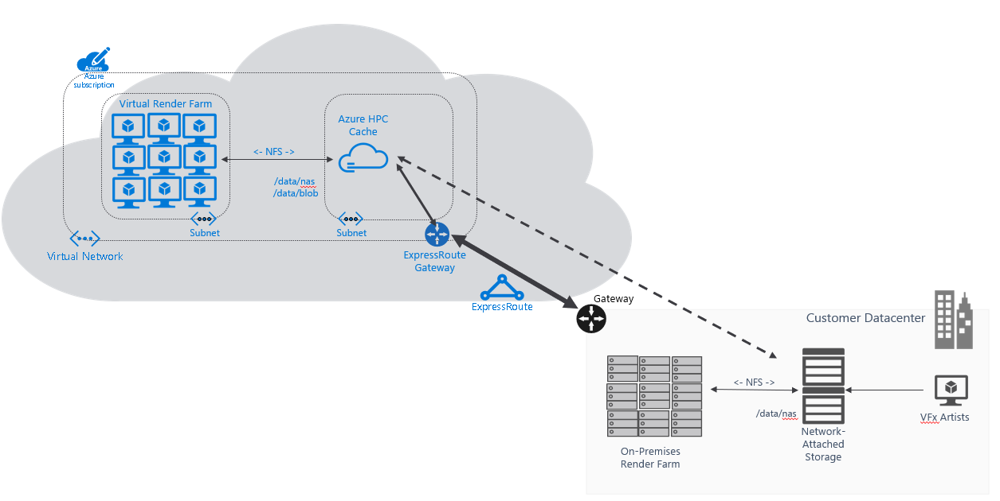
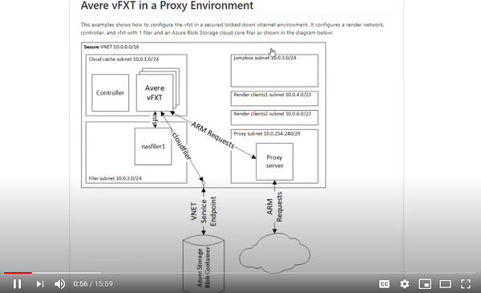

# VFX and Animation Rendering with HPC Cache and Avere vFXT on Azure

To meet tight deadlines and reduce total cost of ownership (TCO), VFX and Animation studios use Azure for on-demand access to compute capacity for their render workloads.  Avere technology enables the cloud burst rendering scenario and makes it easy to extend an on-premises rendering pipeline to Azure with minimal workflow changes.

Customers burst render to Azure for the main reasons of controlling and tracking costs, security, ease of use, and collaboration.  The [Azure rendering white paper](https://azure.microsoft.com/en-us/resources/visual-effects-and-animation-rendering-in-azure/) goes into detail on each of these topics.

The common cloud burst rendering architecture is shown in the following diagram:

There are 4 major cloud infrastructure components that make up a cloud rendering solution:
1. **Network connection** - the burst rendering solution is connected via an [Azure Virtual Private Network (VPN) Gateway](https://docs.microsoft.com/en-us/azure/vpn-gateway/vpn-gateway-about-vpngateways) or an [Azure ExpressRoute](https://azure.microsoft.com/en-us/services/expressroute/).
1. **Custom Image** - customers create a linux or Windows based custom image that contains the necessary rendering and render management software to mount the storage cache and also connect to on-premises services such as a render manager, AD server, and metrics server.
1. **Storage Cache** - a managed HPC Cache or Avere vFXT is used to cache data, and hide latency to on-premises data.
1. **Render Farm** - Virtual Machine Scalesets are used to scale the custom image across thousands of virtual machines.  Additionally [Azure Cycle Cloud](https://azure.microsoft.com/en-us/features/azure-cyclecloud/) is used to help manage the virtual machine scale-sets.

To get started the recommended approach is to follow the [First Render Pilot](examples/securedimage/Azure%20First%20Render%20Pilot.pdf).  The first render pilot provides a phased approach to  build out the burst rendering architecture on Azure.  The resources below will help you through each of the phases.

## Learning

There are multiple video resources to help with learning about burst rendering on Azure:

| Description  | Video Link  |
|---|---|
| [Siggraph 2020 Videos](https://siggraph.event.microsoft.com/) - Six videos from Siggraph 2020 review customer solutions and why render on Azure.  |    |
| [Securing a custom image](https://youtu.be/CNiQU9qbMDk) - This example shows an Azure administrator how to take an on-prem image, upload it to Azure, and then provide secure access to a contributor.  |   |
| [Avere vFXT in a Proxy Environment](https://youtu.be/lxDDwu44OHM) - This example shows how to configure an Avere vFXT in a secured locked down internet environment where access to outside resources is via a proxy.  |   |

The remainder of this page provides Terraform infrastructure examples to build out the rendering architecture:
1. [Rendering Best Practices for Azure Compute, Network, and Storage](#rendering-best-practices-for-azure-compute-network-and-storage) - learn about the best practices for rendering to reduce TCO on Compute, Network, and Storage.
1. [Full End-To-End Examples](#full-end-to-end-examples) - Full end to end examples in Linux and Windows.
1. [Storage Cache Infrastructure](#storage-cache-infrastructure) - Use HPC Cache 
1. [Rendering Accessories Infrastructure](#rendering-accessories-infrastructure) - this provides examples of a dns server, NFS ephemeral filer, secure image, and jumpbox.
1. [Terraform Modules](#terraform-modules) - these are the common infrastructure building blocks that make up the rendering architecture.
1. [Avere vFXT Terraform Provider](#avere-vfxt-terraform-provider) - this is the resource page that provides the full reference to using the Avere vFXT Terraform provider.

## Rendering Best Practices for Azure Compute, Network, and Storage

The highest priority for VFX and Animation Studios is the lowest total cost of ownership (TCO).  The following best practices supplement existing Azure documentation with guidance on how to achieve the lowest TCO.

1. [Best Practices for a New Subscription](examples/new-subscription) - it may be useful for a studio to create a subscription for each office, or each new show to separate out billing.  If this is the case, we recommend creating a one-time process described in this document.
1. [Best Practices for using Azure Virtual Machine Scale Sets (VMSS) or Azure Cycle Cloud for Rendering](examples/vmss-rendering)
1. [Networking Best Practices for Rendering](examples/network-rendering)
1. [Storage Cache Best Practices for Rendering](examples/storagecache-rendering)

## Full End-To-End Examples

**Important Note** Please use Terraform 0.12.x with the following examples.

The following examples provide end-to-end examples that implement the burst rendering architecture in Linux and Windows environments.

1. [Create a Linux based OpenCue managed render farm on Azure](examples/vfxt/opencue) - deploy an end to end render solution on Azure using OpenCue as your render manager.
1. [Create a CentOS Custom  Image and scale on Azure](examples/centos) - shows how to create, upload, and deploy a centos custom image and then scale the image using VMSS.
1. [Create a Windows Render Farm On Azure](examples/houdinienvironment) - this walks through a deployment of a Houdini render environment on Azure.

## Storage Cache Infrastructure

**Important Note** Please use Terraform 0.12.x with the following examples.

Both HPC Cache and Avere vFXT for Azure provide file caching for high-performance computing (HPC).  We recommend to always choose HPC Cache for greater user manageability and only choose Avere vFXT for Azure for custom scenarios where HPC is unable to fit.  If you need to use Avere vFXT for Azure because of a missing feature in HPC Cache, please submit an issue so we can track and add to HPC Cache.

1. [HPC Cache](examples/HPC%20Cache)
   1. [no-filer example](examples/HPC%20Cache/no-filers)
   2. [HPC Cache mounting Azure Blob Storage cloud core filer example](examples/HPC%20Cache/azureblobfiler)
   3. [HPC Cache mounting 1 IaaS NAS filer example](examples/HPC%20Cache/1-filer)
   4. [HPC Cache mounting 3 IaaS NAS filers example](examples/HPC%20Cache/3-filers)
   5. [HPC Cache mounting an Azure NetApp Files volume](examples/HPC%20Cache/netapp)
   6. [HPC Cache extends Azure NetApp Files across regions](examples/HPC%20Cache/netapp-across-region)
   7. [HPC Cache and VDBench example](examples/HPC%20Cache/vdbench)
   8. [HPC Cache and VMSS example](examples/HPC%20Cache/vmss)
   9. [HPC Cache and CacheWarmer](examples/HPC%20Cache/cachewarmer)
2. [Avere vFXT for Azure](examples/vfxt)
   1. [no-filer example](examples/vfxt/no-filers)
   2. [Avere vFXT mounting Azure Blob Storage cloud core filer example](examples/vfxt/azureblobfiler)
   3. [Avere vFXT mounting 1 IaaS NAS filer example](examples/vfxt/1-filer)
   4. [Avere vFXT mounting 3 IaaS NAS filers example](examples/vfxt/3-filers)
   5. [Avere vFXT mounting an Azure NetApp Files volume](examples/vfxt/netapp)
   6. [Avere vFXT extends Azure NetApp Files across regions](examples/vfxt/netapp-across-region)
   7. [Avere vFXT and VDBench example](examples/vfxt/vdbench)
   8. [Avere vFXT and VMSS example](examples/vfxt/vmss)
   9. [Avere vFXT and CacheWarmer](examples/vfxt/cachewarmer)
3. [Specialized Avere vFXT for Rendering and Artists](examples/vfxt)
   1. [Avere vFXT optimized for Houdini](examples/vfxt/HoudiniOptimized)
   2. [Avere vFXT and Cloud Workstations](examples/vfxt/cloudworkstation)
   3. [Avere vFXT only](examples/vfxt/vfxt-only) - this example is useful for when the cloud environment is already configured.
   4. [Avere vFXT in a Proxy Environment](examples/vfxt/proxy) - this example shows how to deploy the Avere in a locked down internet environment, with a proxy.
   5. [Deploy Avere vFXT directly from the controller](examples/vfxt/run-local) - this example shows how to deploy the Avere directly from the controller.
   6. [Specify a custom VServer IP Range with the Avere vFXT](examples/vfxt/custom-vserver) - this example shows how to specify a custom VServer IP Range with the Avere vFXT.
   7. [Avere vFXT using User Assigned Managed Identity](examples/vfxt/user-assigned-managed-identity) - this example shows how to use a user assigned managed identity with the Avere vFXT.
1. [Backup Restore](examples/backuprestore) - Backup any FXT or vFXT cluster and build terraform to restore to HPC Cache or Avere vFXT for Azure.

## Rendering Accessories Infrastructure

**Important Note** Please use Terraform 0.12.x with the following examples.

The following terraform examples build out accessory rendering infrastructure such as DNS Servers, high speed NFS ephemeral filers, and a jumpbox:

1. [DNS Server to Override Filer Address](examples/dnsserver) - This deploys an Azure virtual machine that installs and configures [Unbound](https://nlnetlabs.nl/projects/unbound/about/) and and configures it to override the address of an on-premises filer so that the render nodes mount the Avere to hide the latency.  All other dns requests are forwarded to pre-configured on-premises dns servers.
1. [NFS Ephemeral Filer](examples/nfsfiler) - builds high performance NFS filers.
1. [SecuredImage](examples/securedimage) - shows how to create, upload, and deploy a custom image with an introduction to RBAC, Azure Governance, and Network.
1. [Jumpbox](examples/jumpbox) - this deploys a VM pre-installed with pre-installed with az cli, terraform, golang, and the built avere provider
Security.

## Terraform Modules

These modules provide core components for use with HPC Cache or Avere vFXT for Azure:

1. [CacheWarmer Build](modules/cachewarmer_build) - build the cache warmer binaries, and build the bootstrap install directory for the CacheWarmer
2. [CacheWarmer Manager Install](modules/cachewarmer_build) - install the cachewarmer manager using the bootstrap install directory created by the CacheWarmer build process.
3. [CacheWarmer Submit Job](modules/cachewarmer_submitjob) - submit the path to warm, and block until it is warmed.
4. [Controller](modules/controller) - the controller deploys a controller that is used to create and manage an Avere vFXT for Azure
5. [Jumpbox](modules/jumpbox) - the jumpbox has the necessary environment for building the [terraform-provider-avere](providers/terraform-provider-avere).  It is also useful for when experimenting in virtual networks where there is no controller.
6. [Ephemeral Filer](modules/nfs_filer) - the ephemeral filer provides a high IOPs, high throughput filer that can be used for scratch data.
7. [Render Network](modules/render_network) - the render network module creates a sample render network complete with five subnets: cloud cache, filer, jumpbox, and two render node subnets
8. [Secure Render Network](modules/render_network_secure) - the secure render network module where the internet is locked down to all subnets but the proxy subnet.  This module creates a sample render network complete with six subnets: cloud cache, filer, jumpbox, two render node subnets, and a proxy subnet.
9. [Proxy](modules/proxy) - this installs a proxy VM running the Squid Proxy.
10. [VD Bench Config](modules/vdbench_config) - this module configures an NFS share with the VDBench install tools.
11. [VMSS Config](modules/vmss_config) - this module configures an NFS share with a round robin mount script.
12. [Mountable VMSS](modules/vmss_mountable) - this deploys a Linux based VMSS and runs a script off an NFS share.
13. [Azure CycleCloud](modules/cyclecloud) - this deploys an Azure CycleCloud instance.

## Avere vFXT Terraform Provider

The following provider creates, destroys, and manages an Avere vFXT for Azure:

1. [terraform-provider-avere](providers/terraform-provider-avere)
