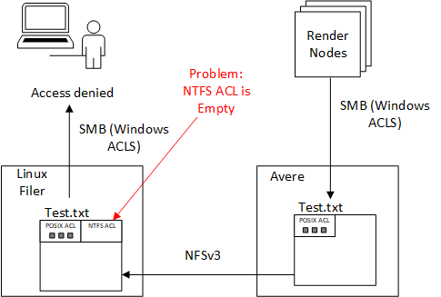

# Storage Cache Best Practices for Rendering

This document describes the storage cache best practices related to rendering.

# Pre-requisites

The following is a checklist of items to confirm before connecting an HPC Cache or Avere vFXT
* ensure your on-prem core filer has the following configured on the export
    * `no_root_squash` - this is needed because HPC Cache or vFXT works at the root level
    * `rw` - read/write is needed for the HPC Cache or vFXT to write files
    * **ip range is open** - ensure the HPC Cache or vFXT subnet is specified in the export.  Also, if any render clients are writing around, you will also need to open up the subnet range of the render clients, otherwise this is not needed.
* ensure the on-prem firewall is open to the HPC Cache or vFXT subnets
* ensure an NFSv3 endpoint is enabled

# Reducing TCO

* use a storage cache to reduce the bandwidth to the cloud, and reduce latency to on-premises filers.
* delete the HPCCache or the Avere vFXT when not in use.
* for the lowest TCO, automate the deployment and teardown the HPC Cache or the Avere vFXT.  Terraform examples are available in this repository for both HPC Cache, and Avere vFXT
* for the Terraform vFXT provider, ensure you use only 3 nodes and the lowest memory to save on storage with the following Terraform:
```bash
    vfxt_node_count = 3
    node_cache_size = 1024
```
* for the Terraform vFXT provider, during dev-test cycles where the Avere is not in production, use the unsupported test SKU:
```bash
    node_size = "unsupported_test_SKU"
```

# SMB

For SMB ensure you set the UID / GID attributes according to the [Avere SMB document](https://azure.github.io/Avere/legacy/pdf/ADAdminCIFSACLsGuide_20140716.pdf).

If you are using a system that requires RID, use the [RID Generation Script](../houdinienvironment/Get-AvereFlatFiles.ps1), and copy the files alongside main.tf, and pass them in as `cifs_flatfile_passwd_b64z` and `cifs_flatfile_group_b64z` as shown in the [Houdini cache example](../houdinienvironment/3.cache/main.tf).

If you have a Netapp or EMC Isilon storage filer, you can enable NTFS ACLS.  Otherwise you will need to rely on [RFC2307](https://tools.ietf.org/html/rfc2307) and the conversion policy on the file.  The conversion to/from POSIX ACLs to NTFS ACLS is lossy, and is described as the [The ACL interoperability Problem](https://wiki.linux-nfs.org/wiki/index.php/ACLs#The_ACL_Interoperability_Problem).

To ensure the best operability between POSIX and NTFS ACLS, ensure you have investigated the following:

1. share folder should have the correct group used for render and a mask of 770, and for NTFS acl do the similar thing and confirm that Everyone has no actions available.

2. Filer SMB and NFS - 770 mask for file create and dir masks

3. On Avere, ensure 0770 for file and dir masks, remove Everyone ACE.

## Troubleshooting SMB

To troubleshoot the ACL problem the following two scenarios show a write from on-prem and a write from a render node in the cloud.

### Problem #1 - Writing from a Windows Machine on-prem

The first scenario shows writing a file from on-prem.  In this example, only the NTFS ACL gets written.  The POSIX ACL is not set, and when the file crosses the NFSv3 boundary to the Avere, the NTFS ACL is sliced off, and access is denied to the render nodes.


You can solve this problem in the following ways:
1. Look at the create and directory masks policies of the Core Filer, and these would be adjusted to `770` to allow for owner and groups.  For example, here are the [create](https://www.samba.org/samba/docs/current/man-html/smb.conf.5.html#CREATEMASK) and [directory mask](https://www.samba.org/samba/docs/current/man-html/smb.conf.5.html#DIRECTORYMASK) configurations for samba.
1. run `chmod -R 770 DIR` on the directory, or setup a cron job on the local core filer.  This step is usually a last resort.

### Problem #2 - Writing from a Windows Machine through the Avere

The second scenario shows writing a file from the render node through the Avere to on-premises.  In this scenario, the Avere writes the POSIX ACL, but when the file lands on the core filer, the NTFS ACL is missing.  File access is then denied to on-premises Windows user, because the empty NTFS ACL is converted to an empty Windows ACL.



You can solve this problem in the following way:
1. Look at the conversion policy from POSIX to NTFS ACLs on the filer.
1. run an NTFS acl command, something like the following `setfacl -R .... DIR` on the directory, or setup a cron job on the local core filer.  This step is usually a last resort.