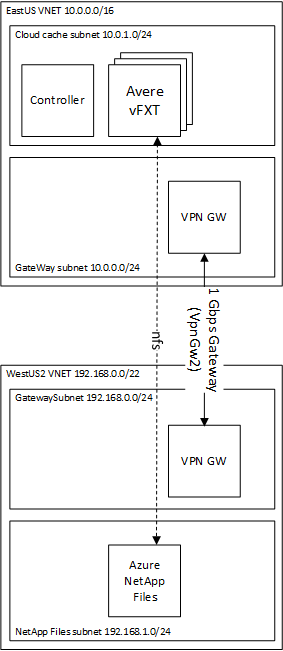

# Avere vFXT extends Azure NetApp Files across regions

An Avere vFXT compliments [Azure NetApp Files](https://azure.microsoft.com/en-us/services/netapp/) by extending the reach of the Azure NetApp Files data outside of the region where the Azure NetApp service resides.  The Avere vFXT provides the following advantages:

1. **Preserves Single Point of Truth** - the Avere vFXT is a cache and preserves the single source of truth of the data located at the source NetApp volume.  This means there are none of the problems associated with replications including replication lag, data race conditions, and data corruption.

2. **Avere vFXT Hides Latency** - the Avere vFXT hides latency from clients mounting the Azure NetApp Files volume from a different region, so the clients receive low latency and high performance.

3. **Avere vFXT makes efficient use of bandwidth** - the Avere vFXT only pulls down the data it needs and only once for unchanged artifacts.  For serving tools binaries or render content, this may mean the difference between requiring a 1Gbps pipe vs. a 10Gbps pipe.

4. **Avere vFXT can be deployed to any region** - the Avere vFXT can be deployed to regions where Azure NetApp Files does not exist as listed in the [region availability for the NetApp files](https://azure.microsoft.com/en-us/global-infrastructure/services/?products=netapp&regions=asia-pacific-east,asia-pacific-southeast,australia-central,australia-central-2,australia-east,australia-southeast,brazil-south,canada-central,canada-east,central-india,europe-north,europe-west,france-central,france-south,japan-east,japan-west,korea-central,korea-south,norway-east,norway-west,south-africa-north,south-africa-west,south-india,switzerland-north,switzerland-west,uae-central,uae-north,united-kingdom-south,united-kingdom-west,us-central,us-east,us-east-2,us-north-central,us-south-central,us-west,us-west-2,us-west-central,west-india,non-regional).

The [NetApp document](https://docs.microsoft.com/en-us/azure/azure-netapp-files/azure-netapp-files-create-volumes#best-practice) mentions that Azure NetApp Files does not work with VNET peering across regions.  This is resolved by using the [Azure VNet-to-VNet VPN gateway solution](https://docs.microsoft.com/en-us/azure/vpn-gateway/vpn-gateway-howto-vnet-vnet-resource-manager-portal).  The VNet-to-VNet VPN gateway can be cheaper than VNET peering in some scenarios since you only pay for the egress and the VPN Gateway, and not both the ingress and egress of the VNET peering.

This example configures a render network, controller, and Avere vFXT where the netapp is configured in a different region.  The VNet-to-VNet VPN gateway connects the two regions as shown in the following diagram.  A 1 Gbps link is configured but this can be configured to be [as high as 10 Gbps and as low as 100Mbps](https://docs.microsoft.com/en-us/azure/vpn-gateway/vpn-gateway-about-vpngateways#gwsku).



## Deployment Instructions

To run the example, execute the following instructions.  This assumes use of Azure Cloud Shell, but you can use in your own environment, ensure you install the vfxt provider as described in the [build provider instructions](../../../providers/terraform-provider-avere#build-the-terraform-provider-binary).  However, if you are installing into your own environment, you will need to follow the [instructions to setup terraform for the Azure environment](https://docs.microsoft.com/en-us/azure/terraform/terraform-install-configure).

1. browse to https://shell.azure.com

2. Specify your subscription by running this command with your subscription ID:  ```az account set --subscription YOUR_SUBSCRIPTION_ID```.  You will need to run this every time after restarting your shell, otherwise it may default you to the wrong subscription, and you will see an error similar to `azurerm_public_ip.vm is empty tuple`.

3. double check your Avere vFXT prerequisites, including running `az vm image accept-terms --urn microsoft-avere:vfxt:avere-vfxt-controller:latest`: https://docs.microsoft.com/en-us/azure/avere-vfxt/avere-vfxt-prereqs

4. Ensure you have requested your subscription has been onboarded to Azure NetApp File and registered your subscription as described here: https://docs.microsoft.com/en-us/azure/azure-netapp-files/azure-netapp-files-register.

5. If not already installed, run the following commands to install the Avere vFXT provider for Azure:
```bash
mkdir -p ~/.terraform.d/plugins
# install the vfxt released binary from https://github.com/Azure/Avere
wget -O ~/.terraform.d/plugins/terraform-provider-avere https://github.com/Azure/Avere/releases/download/tfprovider_v0.9.12/terraform-provider-avere
chmod 755 ~/.terraform.d/plugins/terraform-provider-avere
```

6. get the terraform examples
```bash
mkdir tf
cd tf
git init
git remote add origin -f https://github.com/Azure/Avere.git
git config core.sparsecheckout true
echo "src/terraform/*" >> .git/info/sparse-checkout
git pull origin main
```

7. `cd src/terraform/examples/vfxt/netapp-across-region`

8. `code main.tf` to edit the local variables section at the top of the file, to customize to your preferences.  If you are using an [ssk key](https://docs.microsoft.com/en-us/azure/virtual-machines/linux/mac-create-ssh-keys), ensure that ~/.ssh/id_rsa is populated.

9. execute `terraform init` in the directory of `main.tf`.

10. execute `terraform apply -auto-approve` to build the vfxt cluster

Once installed you will be able to login and use the vFXT cluster according to the vFXT documentation: https://docs.microsoft.com/en-us/azure/avere-vfxt/avere-vfxt-cluster-gui.

When you are done using the cluster, you can destroy it by running `terraform destroy -auto-approve` or just delete the resource groups created.