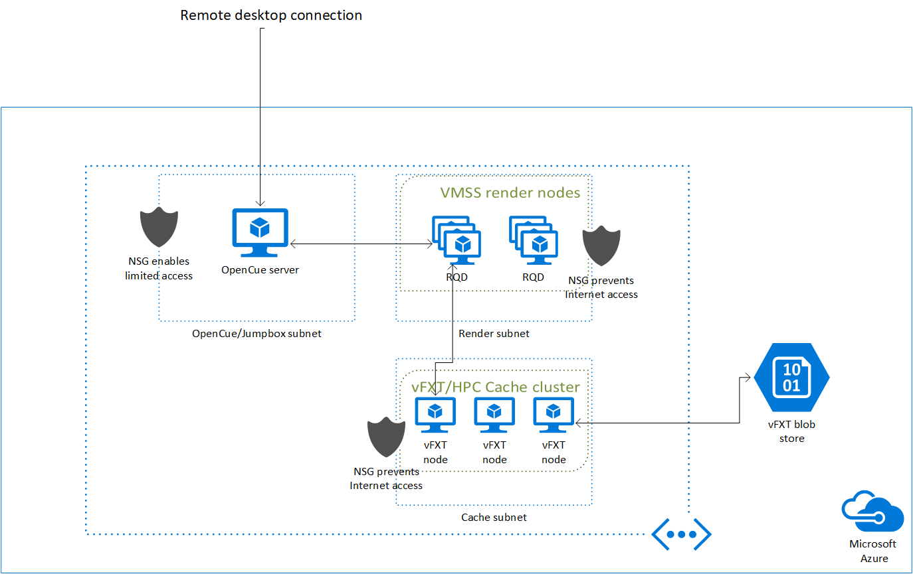

# Deploy Network, vFXT, OpenCue, and OpenCue client nodes

This example deploys a complete environment with OpenCue, render nodes, vFXT, and all the networking required to render the Moana Island Scene. This example assumes you alreade have the scene downloaded to an existing Azure blob storage account that was populated via a previous vFXT deployment. If this is not the case use the [new storage example](../new-storage/README.md) instead.

## Architecure



## Deployment Instructions

1. browse to https://shell.azure.com

2. Specify your subscription by running this command with your subscription ID:  ```az account set --subscription YOUR_SUBSCRIPTION_ID```.  You will need to run this every time after restarting your shell, otherwise it may default you to the wrong subscription, and you will see an error similar to `azurerm_public_ip.vm is empty tuple`.

3. double check your Avere vFXT prerequisites, including running `az vm image accept-terms --urn microsoft-avere:vfxt:avere-vfxt-controller:latest`: https://docs.microsoft.com/en-us/azure/avere-vfxt/avere-vfxt-prereqs

4. If not already installed, run the following commands to install the Avere vFXT provider for Azure:
```bash
mkdir -p ~/.terraform.d/plugins
# install the vfxt released binary from https://github.com/Azure/Avere
wget -O ~/.terraform.d/plugins/terraform-provider-avere https://github.com/Azure/Avere/releases/download/tfprovider_v0.9.19/terraform-provider-avere
chmod 755 ~/.terraform.d/plugins/terraform-provider-avere
```


5. get the terraform examples
```bash
mkdir tf
cd tf
git init
git remote add origin -f https://github.com/Azure/Avere.git
git config core.sparsecheckout true
echo "src/terraform/*" >> .git/info/sparse-checkout
git pull origin main
```

6. `cd src/terraform/examples/vfxt/opencue/pre-existing-azure-blob`

7. `code main.tf` to edit the local variables section at the top of the file, to customize to your preferences.  If you are using an [ssh key](https://docs.microsoft.com/en-us/azure/virtual-machines/linux/mac-create-ssh-keys), ensure that ~/.ssh/id_rsa is populated.

8. execute `terraform init` in the directory of `main.tf`.

9. execute `terraform apply -auto-approve` to build the vfxt cluster

When you are done using the cluster, you can destroy it by running `terraform destroy -auto-approve` or just delete the three resource groups created.


## CueBot Server

### VNC

If you plan to VNC into the CueBot server, you will need to [open a port](https://docs.microsoft.com/en-us/azure/virtual-machines/windows/nsg-quickstart-portal), e.g. port 5901, in the 'ssh_nsg' Network Security Group to set up the tunnel to the VM. `tightvncserver` is installed on the CueBot VM, these are sample commands to configure VNC:
```
vncserver
vncserver -kill :1
mv ~/.vnc/xstartup ~/.vnc/xstartup.bak
nano ~/.vnc/xstartup
```
Add the following to the xstartup file:
```
#!/bin/bash
xrdb $HOME/.Xresources
startxfce4 &
```

Then change permissions and restart vncserver
```
sudo chmod +x ~/.vnc/xstartup
vncserver
```

To start a tunnel from your local machine, you'll need to ensure you have the private key that is the pair of the public key used in the main.tf file. Then use the following command:

```
ssh -I <path to private key> -L 5901:127.0.0.1:5901 -C -N -l azureuser <cuebot VM IP address>
```

Connect to your server by using a local VNC app, e.g. Screen Sharing on OS X, and use the address `127.0.0.1:5901`

### CueGui and CueSubmit

Once connected to the CueBot VM, you can start CueGui in the terminal with the following command:

```
CUEBOT_HOSTS=localhost cuegui
```

To start CueSubmit use the following command:

```
CUEBOT_HOSTS=$CUEBOT_HOSTNAME_OR_IP cuesubmit
```

Sample scripts to render several different shots from the [moana island scene](https://www.disneyanimation.com/resources/moana-island-scene/) are available in the [opencue scripts](../../../../../clientapps/opencue/scripts/moanaislandscene) directory. These scripts make use of [pbrt](https://github.com/mmp/pbrt-v3/) to render the shots. You will need to ensure you have the [moana island scene](https://www.disneyanimation.com/resources/moana-island-scene/) assets downloaded and stored on a core filer accessible by your vFXT/HPC Cache.
