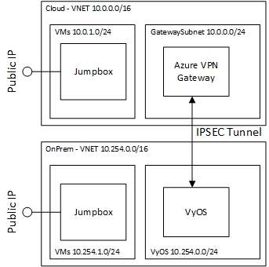

# Azure VPN Gateway to VyOS IPSec Tunnel

When implementing a cloud burst solution a common need of rendering studios is a high bandwidth connection back to on-premises.  This can be achieved through [Azure ExpressRoute](https://azure.microsoft.com/en-us/services/expressroute/).  However, [Azure ExpressRoute](https://azure.microsoft.com/en-us/services/expressroute/) can take 45 to 90 waiting for a connectivity parter to install an interconnect.

In the meantime a VPN connection can be used to connect on-premises to cloud.  An open source project name [VyOS](https://vyos.io/) provides a great VPN implementation.  This example shows how to automate VyOS.

The architecture of this example is shown below and has the following components:
1. **Azure VPN Gateway** - an Azure VPN gateway is deployed into the cloud
1. **VyOS VM** - isolated in it's own subnet, and and NSG only allows communication to the remote Azure VPN Gateway
1. **Jumpbox VM** - provides access to the cloud or on-prem virtual network



This will provide a 1.25Gbps connection with an Azure VPN Gateway.  There is a VyOS limitation to support multiple tunnels.  Multiple links do not work with VTI interfaces.  This functionality will be supported with XFRM interfaces, as described here: https://forum.vyos.io/t/multi-wan-vpn-possible/6089/15.  Once XFRM interface are available, you can use Azure Virtual WAN combined with ECMP + BGP + XFRM.   VYOS with ECMP is described here: https://gist.github.com/bufadu/0c3ba661c141a2176cd048f65430ae8d.

If you need higher than a 1.25Gbps, check out [WireGuard Multi-tunnel implementation using ECMP on Azure](../vpn-multi-tunnel-wireguard).

## Image Creation

These instructions walk through the creation of a Vyos VHD image and are based on the VyOS documentation: https://docs.vyos.io/en/latest/contributing/build-vyos.html#build-iso.  [VyOS can also be deployed through the marketplace.](https://vyos.io/solutions/vyos-on-azure/).

1. deploy ubuntu
1. login to ubuntu
1. install docker per instructions https://docs.docker.com/get-docker/
1. install azcopy instructions https://docs.microsoft.com/en-us/azure/storage/common/storage-use-azcopy-v10
1. git clone -b crux --single-branch https://github.com/vyos/vyos-build
1. cd vyos-build
1. docker run --rm -it --privileged -v $(pwd):/vyos -w /vyos vyos/vyos-build:crux bash
1. ./configure --architecture amd64 --build-by "j.randomhacker@vyos.io"
1. sudo make azure
1. exit the container and run azcopy to copy the vhd to a blob storage account.
```bash
VHD_PATH=$(find . -name *.log | head -1)
STORAGE_ACCOUNT="your storage account"
azcopy login
azcopy $VHD_PATH https://$STORAGEACCOUNT.blob.core.windows.net/vhd/vyos.vhd
```
1. create the vyos image
```bash
# assumes image RG already exists, and location is same region as blob storage account
STORAGE_ACCOUNT="your storage account"
LOCATION=eastus
IMAGES_RG=images_rg

# create the image
az image create --location $LOCATION --resource-group $IMAGES_RG --name vyos1.2 --os-type Linux --source https://$STORAGEACCOUNT.blob.core.windows.net/vhd/vyos.vhd

# list the image id
az image list -g $IMAGES_RG --query "[].id"
```

Now you should be able to use the resulting id for deployment.

## Deployment Instructions

Here are the deployment instructions for the full VyOS infrastructure with Azure VPN Gateway.  [VyOS can also be deployed through the marketplace.](https://vyos.io/solutions/vyos-on-azure/).

1. browse to https://shell.azure.com, and choose a Bash shell.

1. Specify your subscription by running this command with your subscription ID:  ```az account set --subscription YOUR_SUBSCRIPTION_ID```.  You will need to run this every time after restarting your shell, otherwise it may default you to the wrong subscription, and you will see an error similar to `azurerm_public_ip.vm is empty tuple`.

1. get the terraform examples
```bash
mkdir tf
cd tf
git init
git remote add origin -f https://github.com/Azure/Avere.git
git config core.sparsecheckout true
echo "src/terraform/*" >> .git/info/sparse-checkout
git pull origin main
```
1. `cd ~/tf/src/terraform/examples/vpn-single-tunnel-vyos`

1. `code config.auto.tfvars` and edit the variables to match your needs and using the image id you created in the previous step.  Note that the VMSS instance count is only required 

1. `terraform init`

1. `terraform apply -auto-approve`

Once deployed you can login to the cloud or onprem vms and use `iperf3` to test out the tunnel performance:
    1. **iperf3 server** - `iperf3 -s -B CLIENT_IP_ADDRESS`, example `iperf3 -s -B 10.0.1.4`
    2. **iperf3 client** - `iperf3 -c CLIENT_IP_ADDRESS -P PARALLEL_CONNECTIONS`, here is an example with 16 parallel connections: `iperf3 -c 10.0.1.4 -P 16`.  Note that this test will affinitize to a single tunnel, because ECMP affinitizes the source / address pair to a single tunnel.

## Performance Characteristics

The performance of the IPSec tunnel appears to degrade as the latency goes up.  This is a non-exhaustive test, and this framework may be used to confirm the effect of latency on IPSec tunnel throughput:

| Region1 | Region2 | VyOS SKU | VPN SKU | Ping Latency Across Tunnel (ms) | Throughput (Mbps) |
| --- | --- | --- | --- | --- | --- |
| eastus | canadaeast | Standard_F8s_v2 | Generation2, VpnGw2 | 49.4 | 1331 |
| eastus | westus2 | Standard_F8s_v2 | Generation2, VpnGw2 | 69.5 | 881 |
| eastus | southeastasia | Standard_F8s_v2 | Generation2, VpnGw2 | 235 | 650 |
