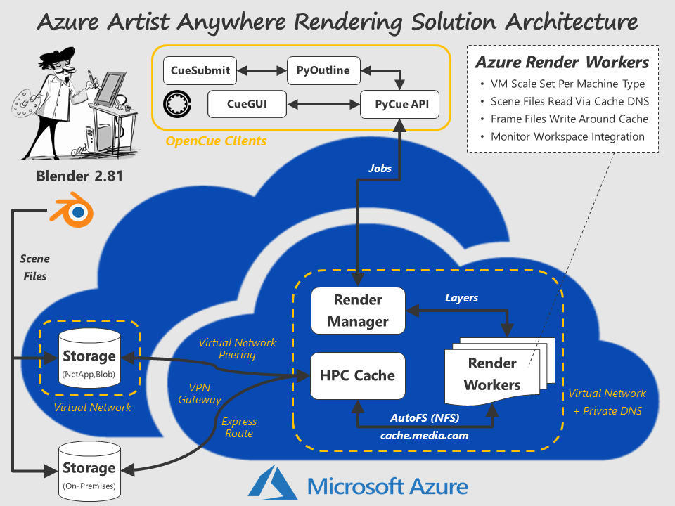

# Azure Artist Anywhere

Azure Artist Anywhere is a series of <a href="https://docs.microsoft.com/en-us/azure/azure-resource-manager/resource-group-overview" target="_blank">Azure Resource Manager (ARM)</a> templates and <a href="https://github.com/PowerShell/PowerShell/releases/latest" target="_blank">PowerShell Core</a> scripts for the automated deployment of an end-to-end media rendering solution in Microsoft Azure. By structuring the solution as a series of modular and parameterized templates, it provides a lightweight deployment framework that can be modified and extended as needed to meet various environment requirements.

Azure Artist Anywhere is composed of the following open-source software and Microsoft Azure services:

<table>
    <tr>
        <td>
            <a href="https://docs.microsoft.com/en-us/azure/virtual-network/virtual-networks-overview" target="_blank">Azure Virtual Network</a>
        </td>
        <td>
            <a href="https://docs.microsoft.com/en-us/azure/hpc-cache/hpc-cache-overview" target="_blank">Azure HPC Cache</a>
        </td>
        <td>
            <a href="https://www.blender.org/" target="_blank">Blender Rendering</a>
        </td>
    </tr>
    <tr>
        <td>
            <a href="https://docs.microsoft.com/en-us/azure/vpn-gateway/vpn-gateway-about-vpngateways" target="_blank">Azure Virtual Network Gateway</a>
        </td>
        <td>
            <a href="https://docs.microsoft.com/en-us/azure/azure-netapp-files/azure-netapp-files-introduction" target="_blank">Azure NetApp Files</a>
        </td>
        <td>
            <a href="https://www.opencue.io/" target="_blank">OpenCue Render Farm Manager</a>
        </td>
    </tr>
    <tr>
        <td>
            <a href="https://docs.microsoft.com/en-us/azure/virtual-machines/" target="_blank">Azure Virtual Machines</a>
        </td>
        <td>
            <a href="https://docs.microsoft.com/en-us/azure/storage/blobs/storage-blobs-overview" target="_blank">Azure Blob Storage</a>
        </td>
        <td>
            <a href="https://docs.microsoft.com/en-us/azure/postgresql/overview" target="_blank">Azure Database for PostgreSQL</a>
        </td>
    </tr>
    <tr>
        <td>
            <a href="https://docs.microsoft.com/en-us/azure/virtual-machine-scale-sets/overview" target="_blank">Azure Virtual Machine Scale Sets</a>
        </td>
        <td>
            <a href="https://docs.microsoft.com/en-us/azure/virtual-machines/linux/image-builder-overview" target="_blank">Azure Image Builder</a>
        </td>
        <td>
            <a href="https://docs.microsoft.com/en-us/azure/load-balancer/load-balancer-overview" target="_blank">Azure Load Balancer</a>
        </td>
    </tr>
    <tr>
        <td>
            <a href="https://docs.microsoft.com/en-us/azure/dns/private-dns-overview" target="_blank">Azure Private DNS</a>
        </td>
        <td>
            <a href="https://docs.microsoft.com/en-us/azure/virtual-machines/linux/shared-image-galleries" target="_blank">Azure Shared Image Gallery</a>
        </td>
        <td>
            <a href="https://docs.microsoft.com/en-us/azure/azure-monitor/" target="_blank">Azure Monitor</a>
        </td>
    </tr>
    <tr>
        <td>
            <a href="https://docs.microsoft.com/en-us/azure/active-directory/fundamentals/active-directory-whatis" target="_blank">Azure Active Directory</a>
        </td>
        <td>
            <a href="https://docs.microsoft.com/en-us/azure/key-vault/key-vault-overview" target="_blank">Azure Key Vault</a>
        </td>
        <td>
            <a href="https://docs.microsoft.com/en-us/azure/virtual-desktop/overview" target="_blank">Azure Virtual Desktop</a>
        </td>
    </tr>
</table>

The following diagram depicts the high-level solution architecture, including multiple options for networking and storage.

The following diagram represents the dependencies between the solution deployment moduless.

The following list describes the purpose of each deployment script file.

* *Deploy.ps1* - the main script that orchestrates the deployment process

* *Deploy.psm1* - the shared module that is referenced from each deployment script

* *Deploy.ImageGallery.ps1* - the background job script that deploys the image gallery

* *Deploy.StorageCache.ps1* - the background job script that deploys storage and caching

* *Deploy.RenderManager.ps1* - the background job script that deploys the render manager

* *Deploy.RenderDesktop.ps1* - the background job script that deploys render desktops

Unlike all of the other background job scripts, the *Deploy.StorageCache.ps1* script can be executed directly for deployment of the Network, Storage and Cache service tiers only.

The following output from a full *Deploy.ps1* orchestrated deployment captures the *start* and *end* times for each deployment step. Note that the background job processes have overlapping times as expected in relation to the main deployment process.

For more information, contact Rick Shahid (rick.shahid@microsoft.com)
