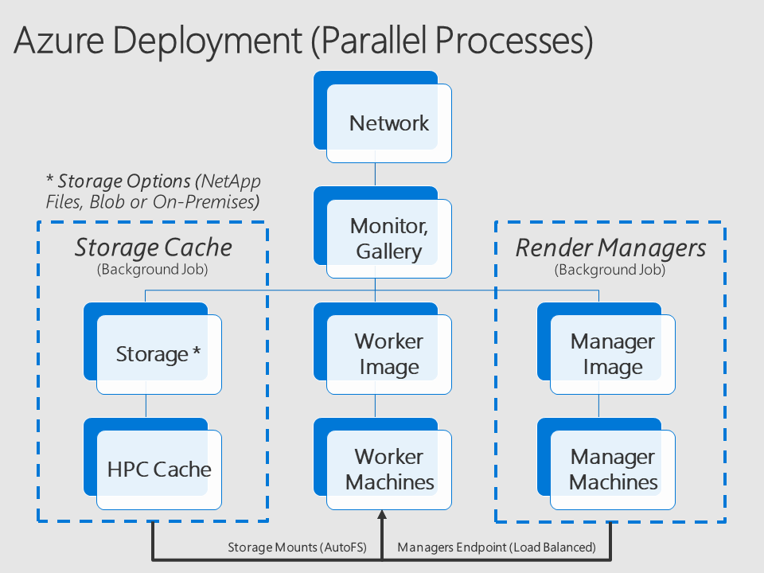

# Azure Artist Anywhere

Azure Artist Anywhere is a set of <a href="https://docs.microsoft.com/en-us/azure/azure-resource-manager/resource-group-overview" target="_blank">Azure Resource Manager (ARM)</a> templates and <a href="https://github.com/PowerShell/PowerShell/releases/latest" target="_blank">PowerShell Core</a> scripts for the automated deployment of a media rendering solution in Azure. By structuring the solution as a set of parameterized templates, it provides a lightweight framework that can be modified and extended to meet various deployment requirements.

Azure Artist Anywhere is composed of the following open-source software and Azure services:

<table>
    <tr>
        <td>
            <a href="https://docs.microsoft.com/en-us/azure/virtual-network/virtual-networks-overview" target="_blank">Azure Virtual Network</a>
        </td>
        <td>
            <a href="https://docs.microsoft.com/en-us/azure/hpc-cache/hpc-cache-overview" target="_blank">Azure HPC Cache</a>
        </td>
        <td>
            <a href="https://www.blender.org/" target="_blank">Blender Rendering</a>
        </td>
    </tr>
    <tr>
        <td>
            <a href="https://docs.microsoft.com/en-us/azure/vpn-gateway/vpn-gateway-about-vpngateways" target="_blank">Azure Virtual Network Gateway</a>
        </td>
        <td>
            <a href="https://docs.microsoft.com/en-us/azure/azure-netapp-files/azure-netapp-files-introduction" target="_blank">Azure NetApp Files</a>
        </td>
        <td>
            <a href="https://www.opencue.io/" target="_blank">OpenCue Render Farm Manager</a>
        </td>
    </tr>
    <tr>
        <td>
             <a href="https://docs.microsoft.com/en-us/azure/virtual-machines/" target="_blank">Azure Virtual Machines</a>
       </td>
        <td>
            <a href="https://docs.microsoft.com/en-us/azure/storage/blobs/storage-blobs-overview" target="_blank">Azure Blob Storage</a>
        </td>
        <td>
            <a href="https://docs.microsoft.com/en-us/azure/postgresql/overview" target="_blank">Azure Database for PostgreSQL</a>
        </td>
    </tr>
    <tr>
        <td>
             <a href="https://docs.microsoft.com/en-us/azure/virtual-machine-scale-sets/overview" target="_blank">Azure Virtual Machine Scale Sets</a>
       </td>
        <td>
            <a href="https://docs.microsoft.com/en-us/azure/virtual-machines/linux/image-builder-overview" target="_blank">Azure Image Builder</a>
        </td>
        <td>
            <a href="https://docs.microsoft.com/en-us/azure/load-balancer/load-balancer-overview" target="_blank">Azure Load Balancer</a>
        </td>
    </tr>
    <tr>
        <td>
             <a href="https://docs.microsoft.com/en-us/azure/dns/private-dns-overview" target="_blank">Azure Private DNS</a>
       </td>
        <td>
            <a href="https://docs.microsoft.com/en-us/azure/virtual-machines/linux/shared-image-galleries" target="_blank">Azure Shared Image Gallery</a>
        </td>
        <td>
        </td>
    </tr>
</table>

The following diagram depicts the high-level solution architecture, including multiple options for networking and storage.

The following diagram depicts the 3 parallel processes (1 main + 2 background jobs) for efficiently deploying the solution.

*Deploy.ps1* is the main orchestration script for deployment of the entire solution. The *Deploy.StorageCache.ps1* script can be executed directly for deployment of the Network, Storage and Cache service tiers only. The *Deploy.RenderManagers.ps1* script is not intended to be executed directly. *Deploy.psm1* is a shared functions module referenced by each script.

For more information, contact Rick Shahid (rick.shahid@microsoft.com)